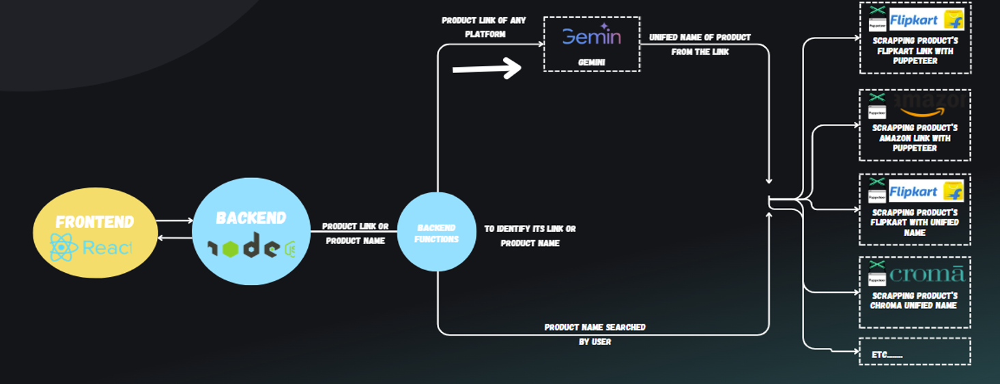

# Price Tracker 🚀

A full-stack, multi-platform product price tracking system that scrapes prices from e-commerce websites, compares them across platforms, stores historical data, and sends automated notifications (WhatsApp/Email) when prices change.

---
<p align="center">  </p>
## ✨ Features

### 🔐 Authentication
- User registration & login
- Secure password hashing (bcrypt)
- JWT-based authentication
- Protected API routes

### 📦 Product Tracking
- Track products across multiple platforms
- Store current price, MRP, discount, rating, images, and links
- Automatically calculate and store lowest price & best platform
- Enable/disable tracking per product

### 📊 My Tracks Dashboard
- View all tracked products in one place
- Compare prices across platforms
- Best deal highlighting
- Delete tracked products
- Last updated timestamps

### 🔔 Notifications (Planned)
- WhatsApp notifications for price drops
- Email notifications
- Notification preferences per product

---

## 🧠 Tech Stack

### Frontend
- **Next.js (App Router)**
- **React + TypeScript**
- Context API (Auth management)
- Tailwind CSS
- Toast notifications

### Backend
- **Node.js + Express**
- **MongoDB Atlas**
- Mongoose (ODM)
- JWT Authentication
- bcryptjs (Password hashing)

---

## 🗄️ Database Schema

### Users
```js
{
  name: String,
  email: String,
  password: String,
  phoneNumber: String,
  whatsappNumber: String,
  createdAt: Date
}

{
  user: ObjectId,
  productName: String,
  platforms: {
    price,
    mrp,
    discount,
    rating,
    productLink,
    imageUrl,
    lastUpdated
  },
  lowestPrice: Number,
  lowestPricePlatform: String,
  trackingEnabled: Boolean,
  notifyByEmail: Boolean,
  notifyByWhatsApp: Boolean,
  createdAt: Date,
  updatedAt: Date
}
```

Backend/
├── src/
│   ├── config/db.js
│   ├── models/
│   ├── controllers/
│   ├── middleware/
│   ├── routes/
│   └── index.js

Frontend/
├── app/
│   ├── auth/
│   ├── tracks/
│   ├── api/
│   └── page.tsx
├── contexts/
│   └── AuthContext.tsx

